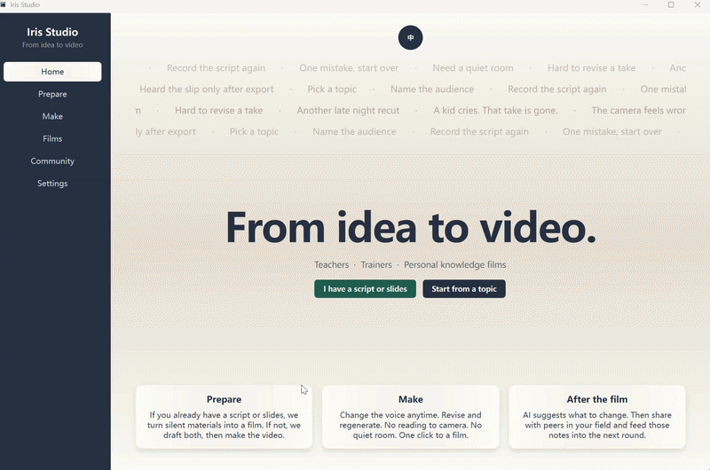
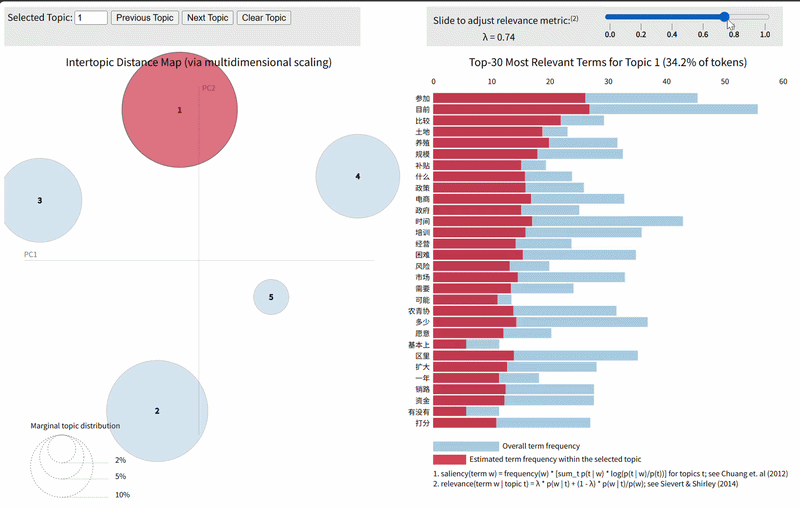

<h1 align="center">Hi, I'm Iris (Jiang Yunzhi)</h1>

  <b>Building AI tools for language learning & education</b> 
  Python 路 NLP 路 courseware pipelines 路 data-driven prototypes

  
  
  

---

## Featured Work

<table>
<tr>
<td width="50%" valign="top">

### AI-Recording
*PPT + script ��?TTS ��?synced teaching video*

 

</td>
<td width="50%" valign="top">

### LDA Text Analysis
*NLP topic modeling 路 interactive visualization*

 

</td>
</tr>
</table>

---

## More Projects

<b>Click to expand ��?web apps, dashboards & practice tools</b>

 

| Project | What it does | Link |
|---------|--------------|------|
| **sql-sprint** | SQL practice tool (Python backend) | [Demo](https://yunzhi1211.github.io/sql-sprint/) 路 [Repo](https://github.com/Yunzhi1211/sql-sprint) |
| **global-spatial-analysis** | Leaflet dashboard, spatial clustering | [Repo](https://github.com/Yunzhi1211/global-spatial-analysis) |
| **electricity-project** | SARIMA forecasting pipeline | [Repo](https://github.com/Yunzhi1211/electricity-project) |
| **puppy-growth-app** | React + TypeScript + Vite | [Repo](https://github.com/Yunzhi1211/puppy-growth-app) |

<b>Tech stack</b>

 

Python 路 pandas 路 statsmodels 路 gensim 路 tkinter 路 R 路 SQL 路 HTML/CSS/JS 路 Leaflet 路 React 路 TypeScript

---

  <i>HKU MSc 路 interested in RA roles at the intersection of AI and language education</i>

