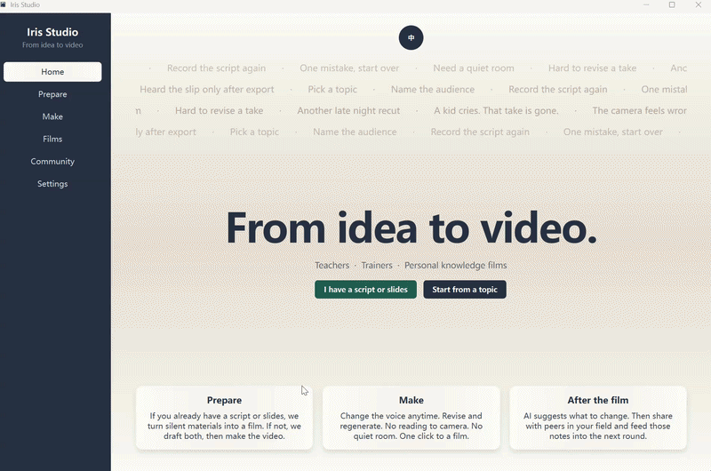
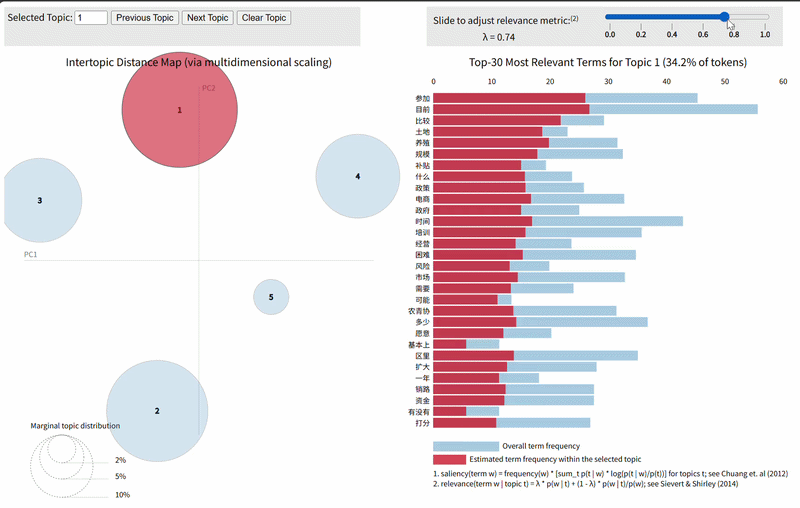

<h1 align="center">你好，我是 Iris（江昀芷）</h1>

  <b>专注于语言学习与教育领域的 AI 工具开发</b> 
  Python · NLP · 课程内容生成 · 数据驱动原型

  <b>中文</b> ·
  <a href="README.md">English</a> ·
  <a href="README.fr.md">Français</a>

  
  
  

---

## 精选项目

<table>
<tr>
<td width="50%" valign="top">

### AI-Recording

*PPT + 讲稿 → TTS → 同步教学视频*

 

</td>

<td width="50%" valign="top">

### LDA 文本分析

*NLP 主题建模 · 交互式可视化*

 

</td>
</tr>
</table>

---

## 更多项目

<b>点击展开 — Web 应用、Dashboard 与练习工具</b>

 

| 项目 | 项目内容 | 链接 |
|---------|--------------|------|
| **sql-sprint** | SQL 练习工具 · Python 后端 | [Demo](https://yunzhi1211.github.io/sql-sprint/) · [Repo](https://github.com/Yunzhi1211/sql-sprint) |
| **global-spatial-analysis** | Leaflet Dashboard · 空间聚类 | [Repo](https://github.com/Yunzhi1211/global-spatial-analysis) |
| **electricity-project** | SARIMA 时间序列预测 | [Repo](https://github.com/Yunzhi1211/electricity-project) |
| **puppy-growth-app** | React + TypeScript + Vite | [Repo](https://github.com/Yunzhi1211/puppy-growth-app) |

---

## 技术栈

<b>Tools & technologies</b>

 

**编程语言**

Python · R · SQL · JavaScript · TypeScript

**数据与 AI**

pandas · statsmodels · gensim · NLP · LDA · Machine Learning

**Web 与可视化**

HTML · CSS · JavaScript · React · TypeScript · Leaflet

**其他**

tkinter · Git · GitHub · 数据可视化 · 统计分析

---

## 关于我

目前就读于 **香港大学 MSc**，正在逐步深入计算机科学、人工智能、NLP 与数据驱动应用。

我喜欢将研究和教育领域中的实际问题转化为可运行的原型，从 NLP 文本分析、交互式数据可视化，到 AI 辅助课程内容生成。

目前特别关注以下方向：

- 🤖 人工智能与 NLP
- 📚 语言学习与教育
- 📊 数据分析与可视化
- 💻 软件开发与研究型原型

---

  <i>HKU MSc · AI · NLP · Data · Education</i>

